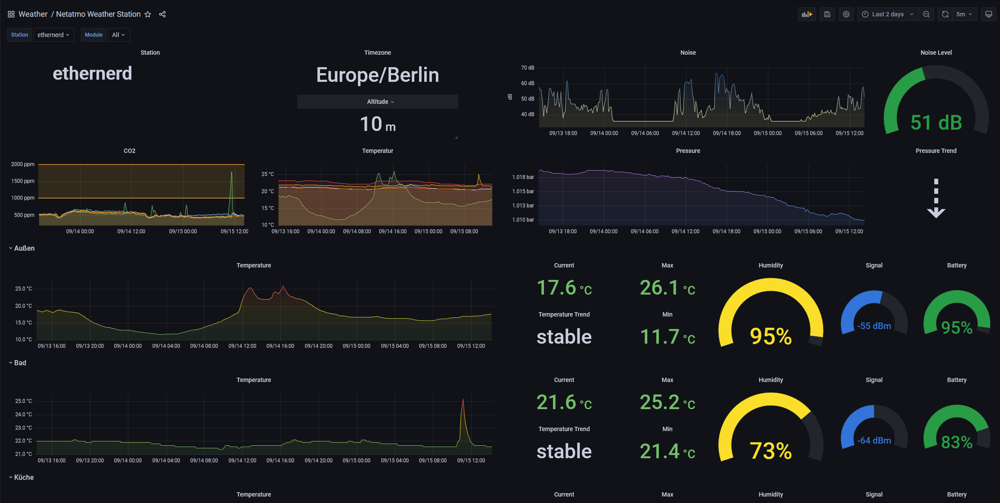

# netatmo-client-influx


Netatmo Weather Station dashboard for Grafana



## Prometheus
Now also available for Prometheus -> [netatmo-exporter](https://github.com/karaktaka/netatmo-exporter)

## InfluxDB 2.0
This Version is for InfluxDB 2.0 only.

If you want to upgrade your Docker InfluxDB to 2.0, there is a guide available [here](https://docs.influxdata.com/influxdb/v2.0/upgrade/v1-to-v2/docker/). 

## Installation

* Create a [Netatmo developer account](https://dev.netatmo.com/apidocumentation) and create an app there.
* Generate a refresh token in your app, scroll down to the "Token generator" and generate a new one with the appropriate scopes.
* Create file called "config" or use Environment Variables and fill in your NETATMO_CLIENT_ID, NETATMO_CLIENT_SECRET and NETATMO_REFRESH_TOKEN.
  * Because of recent changes `refresh_token` needs to be added to a configfile as it needs to be re-generated during runtime and will be written to the config.
* Environment Variables take precedence over everything else and will overwrite your config vars.
* The default is to search for a config file right next to the script, but you can point to any config file with the "-f" switch.

```ini
[global]
interval = 600
loglevel = INFO

[netatmo]
client_id =
client_secret =
refresh_token =

[influx]
influx_host =
influx_port =
influx_bucket =
influx_protocol =
influx_token =
influx_org =
```

```
NETATMO_CLIENT_ID=
NETATMO_CLIENT_SECRET=
INFLUX_HOST=
INFLUX_PORT=
INFLUX_BUCKET=
INFLUX_PROTOCOL=
INFLUX_TOKEN=
INFLUX_ORG=
INTERVAL=600
LOGLEVEL=INFO
```

* Create a cron job to run the script periodically e.g.

```bash
# cat /etc/cron.d/netatmo
*/10 * * * * root  /usr/local/bin/netatmo_influx.py > /dev/null 2>&1
```

You can also use docker to run the script. Either build it yourself or use my prebuilt containers from [GitHub Container Registry](https://github.com/karaktaka/netatmo-client-influx/pkgs/container/netatmo-client-influx).
